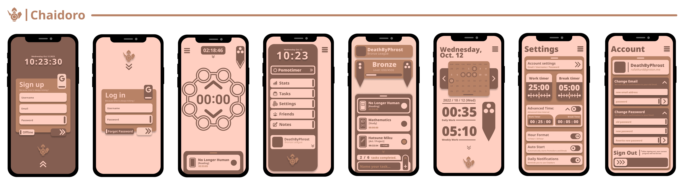

This is the web version of the Chaidoro developed by [Len Hera | ChaiNET](https://github.com/plwtx).
Project is currently under development and is expected to be released as beta version on 15th of January 2025.

## What is Chaidoro ?

Chaidoro is the web application that aims to provide the best pomodoro experience with no data stored on our side and completely open source for its users. All the data is stored at your browser using local storage.

## What is ChaiNET ? / [ChaiNET](https://chainet.dev)

We made of developers creating open source software to help other students / people improve their daily life habits. Our desire is to promote the use of open source! We have no desire to make money or collect data from the applications we produce.

For more information please mail to [sales@chainet.dev](mailto:sales@chainet.dev)

### License

Copyright 2024 [ChaiNET](https://chainet.dev) Developers

Permission is hereby granted, free of charge, to any person obtaining a copy of this software and associated documentation files (the "Software"), to deal in the Software without restriction, including without limitation the rights to use, copy, modify, merge, publish, distribute, sublicense, and/or sell copies of the Software, and to permit persons to whom the Software is furnished to do so, subject to the following conditions:

The above copyright notice and this permission notice shall be included in all copies or substantial portions of the Software.

THE SOFTWARE IS PROVIDED "AS IS", WITHOUT WARRANTY OF ANY KIND, EXPRESS OR IMPLIED, INCLUDING BUT NOT LIMITED TO THE WARRANTIES OF MERCHANTABILITY, FITNESS FOR A PARTICULAR PURPOSE AND NONINFRINGEMENT. IN NO EVENT SHALL THE AUTHORS OR COPYRIGHT HOLDERS BE LIABLE FOR ANY CLAIM, DAMAGES OR OTHER LIABILITY, WHETHER IN AN ACTION OF CONTRACT, TORT OR OTHERWISE, ARISING FROM, OUT OF OR IN CONNECTION WITH THE SOFTWARE OR THE USE OR OTHER DEALINGS IN THE SOFTWARE.

###### _Keep in mind that this license will be modified in the future to cover more areas._
